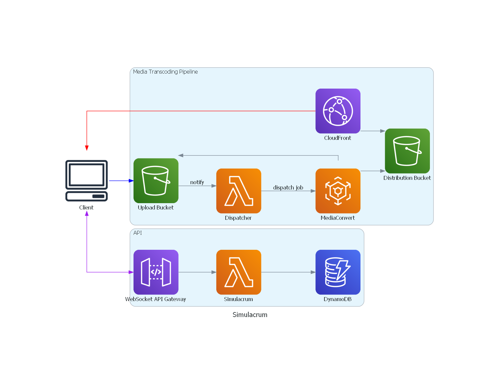

# Simulacrum

Video shmideo

## Usage

Don't

## Developing

This section is a work in progress

### NUKE

Simulacrum uses NUKE as a build script manager. It is strongly recommended to install the
[global tool](https://nuke.build/docs/getting-started/installation/) and IDE extension ([Rider](https://nuke.build/docs/ide/rider/),
[ReSharper](https://nuke.build/docs/ide/resharper/), [Visual Studio](https://nuke.build/docs/ide/visual-studio/),
[Visual Studio Code](https://nuke.build/docs/ide/vscode/)) when developing Simulacrum.

Run `nuke YarnInstall` (or `yarn install`) to install the Node.js package dependencies (*TODO: Check for `yarn` first*).

Running `nuke YarnDev` (or `yarn dev`, or `turbo dev`, if you have the appropriate tools installed already) will run the development
servers.

### Repository structure

All project components are stored in the `src` directory. Their purposes are listed below:

```
simulacrum-cloud-api: The WebSocket API.
simulacrum-cloud-aws-cdk: IaC for provisioning AWS resources.
simulacrum-cloud-aws-local: Docker Compose things for AWS development.
simulacrum-cloud-diagrams: Solution architecture diagrams.
simulacrum-dalamud-*: Dalamud plugin-related projects.
```

### FFmpeg

Simulacrum relies on FFmpeg for AV-decoding. If you are modifying the native libraries, make sure you have the FFmpeg development files installed.

If you use `vcpkg`, the dependencies can be installed with `vcpkg install ffmpeg[all] --triplet x64-windows`.

The plugin should always be built for the x64 platform, to match the game itself.

### Backend

The backend is built in Nest on AWS, using Node-based tooling.

Backend components will have self-hosted equivalents written after the initial version is done. The AWS backend will represent
a reference architecture that can be refactored and simplified for more constrained environments.

#### Architecture diagram


