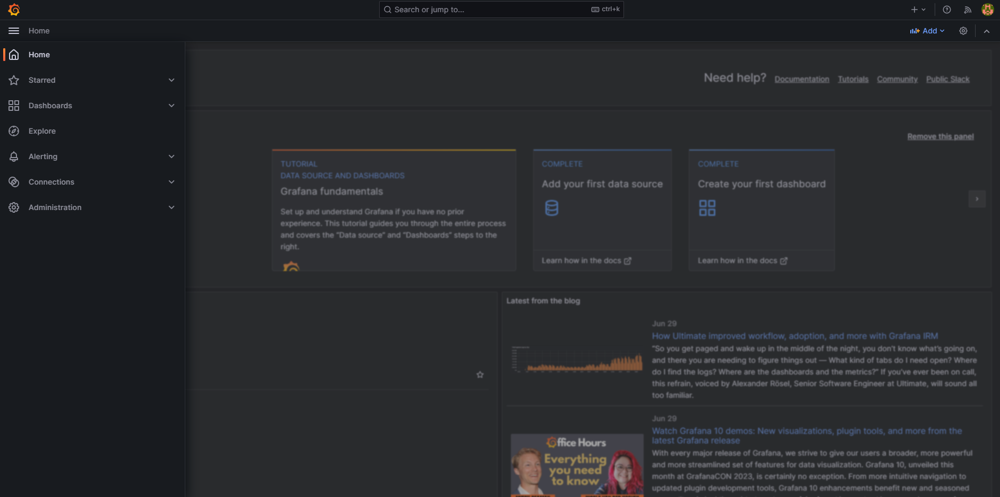
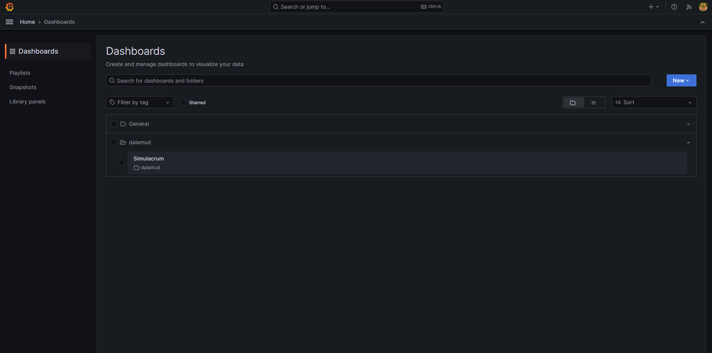
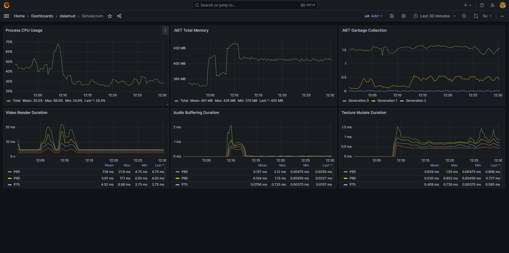
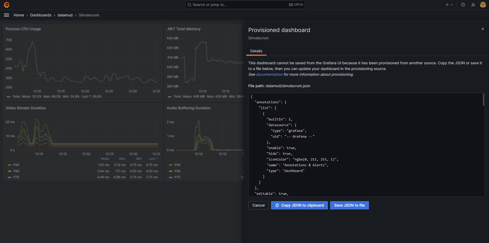

# simulacrum-dalamud-debug
This is the supplementary debug stack for the Simulacrum Dalamud plugin.

## Usage

The debug stack can be started by running the following command in this folder:

```sh
docker compose up -d
```

When the plugin is built in Debug mode, it will include a built-in Prometheus exporter. This exporter needs permission
to use the HTTP.sys driver, which can be enabled by running the following command in an elevated terminal on Windows
(do not include `[]` or `<>`):

```sh
netsh http add urlacl url=http://+:7231/metrics user=[DOMAIN\]<user>
```

This only needs to be done once, unless the exporter port changes.

`DOMAIN\` is optional, and may not be applicable on your system. If you use Windows with a Microsoft account, `user`
is the email you use to sign into your account.

The Grafana setup can be accessed on `localhost:9000` using the username `admin` and the password `admin`. The first
time you log in, it will prompt you to set a new password. If you ever forget this password, just stop the stack,
delete `devenv/grafana/grafana.db`, and start the stack again.

The dashboard list can be accessed from the Grafana menu:



The dashboard itself can be accessed from the dashboard list:



On the dashboard, graphs for numerous relevant metrics should be shown. These can be used to identify possible hotspots
that should be profiled for more information.



If you change the dashboards, you can save the changes with `Ctrl+S`. The dashboards are provisioned so that they can
be easily shared, so the resulting JSON blob should be saved to `devenv/dashboards/dalamud/simulacrum.json`.



If you would like to avoid this, you can save a copy of the dashboard, which will be persisted to the local database
instead.
